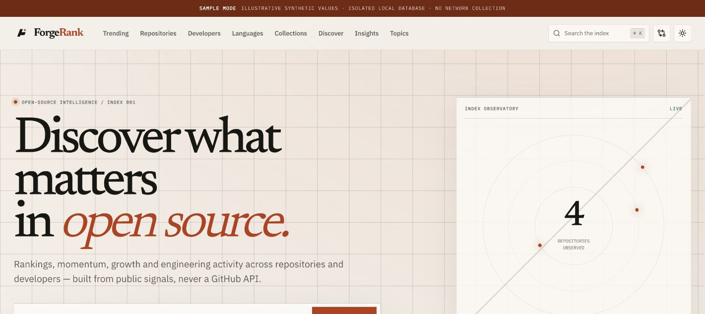

<p align="center">
  
</p>

<h1 align="center">ForgeRank</h1>

<p align="center"><strong>Explainable repository rankings from public evidence—without GitHub API credentials.</strong></p>

<p align="center">
  <a href="https://othmaneblial.github.io/ForgeRank/">Project site</a> ·
  <a href="https://othmaneblial.github.io/ForgeRank/demo.html">Guided demo</a> ·
  <a href="https://othmaneblial.github.io/ForgeRank/docs.html">Documentation</a> ·
  <a href="SCORING.md">Scoring method</a>
</p>



ForgeRank helps you compare the momentum, engineering activity, maturity, and contributor structure of public repositories—then inspect exactly why every score and rank exists.

It ranks only the repositories it has observed. Missing, blocked, stale, or insufficient evidence stays visible instead of being estimated.

## Try a useful screen first

Requirements: Node.js 22.16+, pnpm 11.22+, and Git 2.40+.

```bash
git clone https://github.com/OthmaneBlial/ForgeRank.git
cd ForgeRank
corepack enable
pnpm install --frozen-lockfile
pnpm demo
```

Open [http://127.0.0.1:3001](http://127.0.0.1:3001).

Sample mode creates a dedicated `data/demo-pglite` database containing four fictional repositories and synthetic observations. A persistent banner labels every screen. It does not contact GitHub, does not touch the normal local database, and is safe to rebuild repeatedly.

Prefer to look before cloning? The [guided browser demo](https://othmaneblial.github.io/ForgeRank/demo.html) lets you switch repositories and evidence windows, open score reasons, and see the cohort boundary using the same clearly labeled fictional dataset.

## What ForgeRank answers

| Question                                                | Product surface                                     | Evidence boundary                                                           |
| ------------------------------------------------------- | --------------------------------------------------- | --------------------------------------------------------------------------- |
| What is moving inside my tracked set?                   | Trending modes and the Momentum Matrix              | Comparable retained snapshots only                                          |
| Is a project large, accelerating, active, or all three? | Reach × momentum and repository score reasons       | Each dimension keeps raw inputs and confidence                              |
| Why did this repository rank here?                      | Six persisted score reasons and global rank history | Score version, cohort size, and calculation time stay visible               |
| Which projects are genuinely related?                   | Deterministic similarity and technology ecosystems  | Shared language, topics, technologies, keywords, collections, and lifecycle |
| What changed since the last observation?                | Repository timeline, daily pulse, and weekly report | Derived only from retained evidence; no reconstructed dates                 |
| Can developer evidence be shown responsibly?            | Confirmed profiles and non-fork portfolios          | Git authors are never silently relabeled as public accounts                 |

ForgeRank is not a quality oracle, security scanner, hiring score, or universal GitHub leaderboard. It is an evidence workbench for a disclosed observed corpus.

## Why not just sort by stars?

Stars describe observed reach. They do not explain whether activity is sustained, attention is accelerating, contributor structure is concentrated, or the repository evidence is fresh enough to compare.

ForgeRank keeps those questions separate:

- **Impact** measures observed reach inside the indexed corpus.
- **Momentum** uses comparable snapshot windows rather than a popularity fallback.
- **Health** describes recent bounded activity and visible repository structures.
- **Community** uses privacy-safe Git-author depth and distribution.
- **Engineering** records sustained activity and maintenance infrastructure.
- **Trust** reflects evidence completeness and cautious anomaly handling.

The raw dimension sum is multiplied by observation confidence. Every calculation persists one positive, neutral, caution, or missing reason per dimension. See [SCORING.md](SCORING.md) for the exact formulas and interpretation limits.

## The evidence boundary

ForgeRank does not call GitHub’s REST or GraphQL APIs, require a token or OAuth grant, use a GitHub App or authenticated session, call hidden frontend endpoints, fetch Git LFS objects, or depend on external AI services.

It can use:

- selected public repository pages only when the current robots rules allow the exact URL;
- bounded normal HTTPS Git operations and allowlisted repository files;
- version-controlled identifiers and curated collections;
- its own timestamped, append-only observations and derived aggregates.

Collection is identified, cached, budgeted, and stopped on robots denial, throttling, or uncertainty. Avoiding REST/GraphQL credentials does **not** mean unlimited access, GitHub approval, or complete coverage. Read the full [data-source contract](DATA_SOURCES.md), [privacy boundary](PRIVACY.md), and [architecture decisions](docs/DECISIONS.md).

## Start a real local index

The normal first run creates an embedded PGlite database, migrates it, and loads identifier-only seeds. It makes no GitHub request.

```bash
./run.sh
```

Open [http://127.0.0.1:3000](http://127.0.0.1:3000). The initial empty-evidence states are expected. When you deliberately want to collect a bounded public sample, use a second terminal:

```bash
pnpm forge bootstrap --limit 12
pnpm forge inspect solidjs/solid
pnpm forge rank
```

Production HTTP requests never perform synchronous external collection. Submission and refresh actions only prioritize deduplicated queue work for the separate worker.

## Architecture

```text
Validated identifiers / submissions
                │
                ▼
      PostgreSQL-backed job queue
                │
         ┌──────┴──────┐
         ▼             ▼
 exact robots check  bounded HTTPS Git
 + selected page     + allowlisted files
         └──────┬──────┘
                ▼
     normalized, versioned evidence
                ▼
 append-only snapshots + provenance
                ▼
 scores, reasons, ranks, reports, UI
```

The presentation layer never parses source HTML or invokes Git. PGlite supports local development; PostgreSQL supports the worker, shared budgets, queue locking, search, and deployment. Start with [ARCHITECTURE.md](ARCHITECTURE.md) and the concise [project documentation](https://othmaneblial.github.io/ForgeRank/docs.html).

## Current limitations

- A fresh real index contains identifiers, not analytics.
- Weekly, monthly, and longer trends remain unavailable until real snapshots span those windows.
- Public page structure, robots rules, Git service behavior, and GitHub policies can change.
- Rankings cover ForgeRank’s observed corpus, not every GitHub repository.
- Git authors are not automatically confirmed public accounts.
- File presence, activity, popularity, and score reasons do not prove correctness, security, code quality, maintainer intent, or individual worth.
- The guided and local demos use fictional repositories and synthetic values; they demonstrate behavior, not current external facts.

The detailed implementation ledger is in [docs/PROGRESS.md](docs/PROGRESS.md). It records both verified work and evidence that still needs time or external operation.

## Verify the project

GitHub Actions is intentionally paused during the current product rework. The repository-local gates remain canonical:

```bash
pnpm format:check
pnpm verify
pnpm test:e2e
pnpm audit:accessibility
pnpm audit:performance
pnpm audit:postgres
```

`pnpm verify` runs the zero-API architecture guard, lint, typecheck, unit tests, and a production build. Browser fixtures are deterministic, isolated, and network-free. The PostgreSQL audit uses a disposable database and never targets an existing database unless `DATABASE_URL` explicitly points to one.

## Contributing

Useful contributions include:

- reporting a scoring or source-parser defect with reproducible evidence;
- adding sanitized parser fixtures and failure cases;
- improving score explanations, accessibility, or documentation;
- implementing a scoped item from the roadmap;
- proposing a larger acquisition or scoring change before coding it.

Read [CONTRIBUTING.md](CONTRIBUTING.md) for setup, architecture boundaries, fixture rules, and the required checks. Report vulnerabilities privately as described in [SECURITY.md](SECURITY.md).

## License status

A reusable software license has not been selected yet. The source is publicly readable, but copyright law applies and reuse rights should not be assumed until the repository owner adds a license. Selecting an explicit license is the remaining community-readiness decision.

ForgeRank is an independent project and is not affiliated with, endorsed by, or sponsored by GitHub, Inc. GitHub is a trademark of GitHub, Inc.
