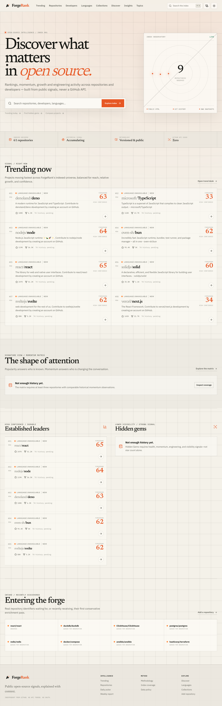

# ForgeRank

**Discover what matters in open source.**

ForgeRank is an open-source intelligence platform for repository rankings, momentum, engineering activity, discovery, comparison, and ecosystem analysis. It is designed to get more useful as its own snapshot history grows—and to stay honest before that history exists.



## The defining constraint

ForgeRank does not use the GitHub REST API, GraphQL API, tokens, OAuth, GitHub Apps, authenticated sessions, hidden frontend endpoints, external AI services, or commercial data APIs.

It observes only policy-permitted public HTML documents, normal public Git transport, public repository files, explicitly documented seed identifiers, and its own append-only history. A CI guard rejects prohibited runtime patterns.

## What works today

- Premium responsive product UI with light/dark themes and keyboard command search.
- PostgreSQL full-text and trigram-fuzzy search across repositories, owners, developers, languages, technologies, topics, and collections, with real suggestions and complete keyboard navigation.
- Repository discovery, public URL submission, deduplicated database queue, and a worker.
- Conservative HTML acquisition with robots checks, persistent cache, budgets, jitter, backoff, retry-after handling, size limits, and a circuit breaker.
- Shared database-backed request budgets/circuits and stale worker-lock recovery across restarts.
- Cadence-driven hot/active/normal/cold refresh scheduling with deterministic priority, deduplication, cooldowns, and persistent privacy-hashed intake limits.
- Versioned fixture-tested repository and public-profile HTML parsers with provenance and structural validation.
- Safe shallow/blobless Git inspection using argument arrays—never interpolated shell commands.
- Git-derived activity, privacy-safe author concentration, primary-language detection, quality signals, and technology detection.
- Bounded README structure analysis for observed blob size, headings, recognized badges, installation guidance, and documentation links, with no subjective quality grade.
- Versioned ForgeRank Signals that translate maintenance cadence, lifecycle, contributor structure, snapshot momentum, repository structures, and visible Git tags into factual evidence cards without predicting quality or maintainer intent.
- Evidence-weighted related repositories plus browseable deterministic technology ecosystems.
- Append-only repository/developer/ranking/language-ecosystem snapshots, source-document audit records, repository aliases/transfers, versioned scores with persisted dimension-level reasons, and bounded background downsampling for long histories.
- Repository detail rank history with accessible completed-run charts, exact current ranking denominators, and honest 24-hour, 7-day, and 30-day movement windows that never interpolate missing runs.
- Versioned repository timelines that derive observed-star and indexed-rank crossings, comparable momentum increases, resumed activity, dormancy transitions, and new Git tags only from retained evidence; first observations never backfill milestones, tags are not automatically labeled releases, and exact external dates are never reconstructed.
- Confirmed developer profiles, explicit non-fork portfolio evidence, transparent developer score v1, strict Git-author identity boundaries, and nine distinct evidence-gated developer leaderboard categories with shareable ecosystem/location/activity/archetype filters.
- A rich repository leaderboard with ten ranking modes; real 1/7/30/90-day, one-year, and all-history growth windows; language, star-band, age, lifecycle, original/fork, and search filters; sortable evidence columns; exact denominators; server pagination; shareable URLs; and dedicated mobile cards.
- Repository details, deterministic topics, trending, discovery, shareable two-to-five repository and indexed-language ecosystem comparisons, languages, collections, coverage, coverage-bounded daily/weekly intelligence reports, badges, local watchlists, and repository submission.
- A shareable Momentum Matrix with language, topic, repository-age, and minimum-star filters; fixed-scale momentum, logarithmic observed popularity, real snapshot-window growth evidence, explicit coverage denominators, accessible point details, and honest missing-history states.
- Distinct evidence-gated Trending, Rising, Breakout, Most Improved, Hidden Gems, Established, Most Active, and neutrally worded Cooling Giants modes with shareable 1/7/30-day windows and no popularity fallback when history is missing.
- Privacy-safe JSON/CSV repository exports, including versioned derived timeline events in JSON, plus dynamic repository/developer social cards.
- PWA manifest, offline shell/recent-page behavior, dynamic sitemap, canonical product metadata, and accessible mobile alternatives for dense tables.
- Accessible loading skeletons on data-heavy routes, in-shell retry recovery, a self-contained root failure document, and a custom no-guess 404 that preserves its real HTTP status.
- Embedded PostgreSQL-compatible local development with PGlite; PostgreSQL in Docker/production.

The complete product specification remains broader. [Progress](docs/PROGRESS.md) records what is implemented and what is still required without relabeling incomplete work as finished.

## Quick start

Requirements: Node.js 22+, Git 2.40+, and network access only when you explicitly run public-data indexing.

```bash
./run.sh
```

The script installs dependencies, migrates the embedded local database, loads repository identifiers and collections, then starts the app. It does **not** contact GitHub. In another terminal, enrich a small policy-governed batch:

```bash
pnpm forge bootstrap --limit 12
pnpm forge inspect solidjs/solid
pnpm forge rank
```

Or run the steps yourself:

```bash
pnpm install
pnpm db:migrate
pnpm seed
pnpm dev
```

No GitHub credentials exist in `.env.example` because ForgeRank has no credential-based GitHub path.

## Operational CLI

```text
pnpm forge index owner/repository
pnpm forge index-user username
pnpm forge inspect owner/repository
pnpm forge refresh owner/repository
pnpm forge schedule --limit 25
pnpm forge bootstrap --limit 12
pnpm forge recalculate
pnpm forge recalculate-users
pnpm forge rank
pnpm forge developer-hide username --reason "verified request"
pnpm forge developer-show username --reason "approved restoration"
pnpm forge developer-correct username bio hide --reason "verified correction"
pnpm forge developer-audit username
pnpm forge ecosystem-snapshot
pnpm forge snapshot-maintenance          # dry-run report
pnpm forge snapshot-maintenance --apply  # deliberate downsampling
pnpm forge cache-status
pnpm forge cache-prune
pnpm forge queue-status
pnpm forge worker-health --max-age 90
pnpm worker
```

`index` observes a policy-permitted public repository document. `index-user` observes a public user profile and scores only explicitly non-fork repositories already in the index. `inspect` performs a bounded Git clone/fetch. `bootstrap` is intentionally conservative and defaults to 12 identifiers. `refresh` and repository-page requests only prioritize deduplicated queue work; `schedule` fills a bounded batch according to cadence and interest. Developer visibility/correction commands are local operator controls, require an audit reason, and preserve source provenance. Ranking runs append language-ecosystem snapshots. Snapshot maintenance keeps full resolution for 90 days, one observation per UTC day through one year, then one per UTC week; its CLI is dry-run unless `--apply` is explicit. Production HTTP requests never trigger synchronous external collection.

## Architecture

```text
Curated identifiers / user submissions
                  ↓
        Database-backed job queue
                  ↓
 Robots-aware HTML fetcher   Safe Git inspector
                  ↘          ↙
             Normalized evidence
                    ↓
       Append-only snapshots + provenance
                    ↓
     Versioned scoring and ranking jobs
                    ↓
        Cached server-rendered product UI
```

The presentation layer never parses source HTML or invokes Git. See [ARCHITECTURE.md](ARCHITECTURE.md), [DATA_SOURCES.md](DATA_SOURCES.md), and [SCORING.md](SCORING.md).

## Verification

```bash
pnpm verify:zero-api
pnpm audit:dependencies
pnpm format:check
pnpm lint
pnpm typecheck
pnpm test
pnpm build
pnpm test:e2e
pnpm audit:accessibility
pnpm audit:performance
pnpm audit:postgres
```

Tests do not require public GitHub traffic. Parser tests use sanitized version-controlled fixtures; every E2E and performance run rebuilds a dedicated PGlite database containing explicit test-only evidence and never reuses the development database or calls the network. Production seeds remain identifier-only. The production dependency audit checks the lockfile through pnpm and runs in CI. The accessibility audit covers representative desktop/mobile routes in both themes, keyboard focus behavior, and reduced motion. The separate performance audit builds and serves the optimized standalone application, then enforces the documented local lab budgets in [PERFORMANCE.md](PERFORMANCE.md). The PostgreSQL audit uses `DATABASE_URL` when supplied; otherwise it creates and removes an isolated local cluster, then verifies idempotent migrations, extensions, seed counts, filtered snapshot-backed Momentum Matrix and repository-leaderboard reads, persisted revival evidence, queue locking, persistent limits, and worker heartbeats without touching an existing database.

## Docker

```bash
docker compose up --build
docker compose run --rm worker pnpm seed
```

The compose stack contains PostgreSQL, a one-shot migration service, a minimal standalone web image, and a separate operations image for the CLI/worker. Both application images run as an unprivileged user under `tini`; PostgreSQL, Git cache, and HTTP cache use separate volumes. Web readiness verifies a database query, while worker readiness requires a fresh database-backed heartbeat. Public `/api/health/live` and `/api/health/ready` responses intentionally expose no internal queue or source state. Set a URL-safe `FORGERANK_POSTGRES_PASSWORD`, the public `NEXT_PUBLIC_SITE_URL`, a real `FORGERANK_CONTACT_URL`, and a unique `FORGERANK_RATE_LIMIT_SALT` outside local development.

## Operator dashboard

`/admin/system` is disabled by default. For loopback-only development, start the app with `FORGERANK_ENABLE_LOCAL_ADMIN=1`; that bypass is rejected in production and for any non-loopback host.

For a production deployment, set `FORGERANK_ENABLE_ADMIN=1`, inject a non-empty `FORGERANK_ADMIN_USERNAME`, and inject a unique `FORGERANK_ADMIN_PASSWORD` of at least 20 characters from the deployment secret store. The route uses HTTP Basic authentication, exact constant-time credential comparison, a second authorization check beside the data query, and private/no-store responses. Serve it only over HTTPS and ensure the reverse proxy forwards the `Authorization` header. A private network or proxy IP allowlist is still recommended as another boundary.

## Important limitations

- A fresh seed contains identifiers, not analytics. Metrics appear only after real observations.
- Weekly/monthly momentum remains unavailable until sufficient snapshots exist.
- Public HTML can change; parser fixtures, failure tracking, and circuit breaking reduce—but cannot eliminate—maintenance.
- Git authors are not automatically confirmed public accounts.
- Rankings cover ForgeRank's indexed universe, not every GitHub repository.
- Signals do not prove code quality, project security, maintainer intent, manipulation, or individual worth.

## Contributing and policy

Read [CONTRIBUTING.md](CONTRIBUTING.md), [SECURITY.md](SECURITY.md), and [PRIVACY.md](PRIVACY.md). Any acquisition change must preserve the zero-API boundary, robots policy, conservative budgets, source provenance, and privacy constraints.

ForgeRank is independent from GitHub and is not an official GitHub product.
